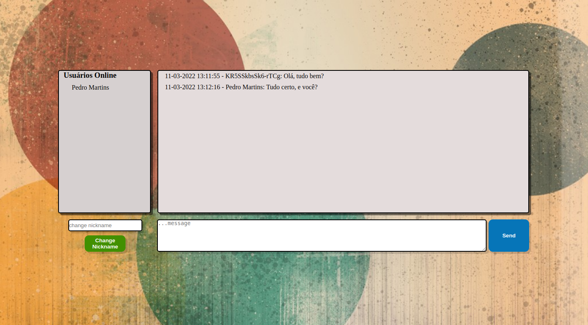

# Projeto WebChat

Projeto utilizando pacote Socket.io do Node.js para criar eventos personalizados durante o curso da Trybe;
Também foi utilizado o EJS para usar código javascript no html; 

## O que foi desenvolvido
A aplicação é capaz de:

 - Usar um front-end para enviar mensagens a clientes conectados;
 - Visualizar o histórico de mensagens da conversa salvas no MongoDB;
 - Visualizar os usuários online no momento;
 - Alterar o nome de usuário no chat em tempo real;

O desenho abaixo demonstra como o projeto pode ser estruturado ao decorrer do desenvolvimento, use a sua criatividade para surpreender! 🧑‍🎨

